  

  

  

  <b>Tỷ Phú Pixel</b> started as a tiny clicker and kept growing — 120+ pets, gacha banners, domains, a world chat
  and a real leaderboard with server-side anti-cheat. Currently shipped as a single HTML file (installable as a PWA)
  and still growing fast; a proper modular codebase is on the roadmap. 
  Play at <a href="https://typhupixel.com">typhupixel.com</a> · screenshots &amp; release notes in <a href="https://github.com/PmSubin/typhupixel">PmSubin/typhupixel</a>

  

  

  

  Reach me: <a href="https://github.com/PmSubin">GitHub</a> · <a href="https://typhupixel.com">typhupixel.com</a>

